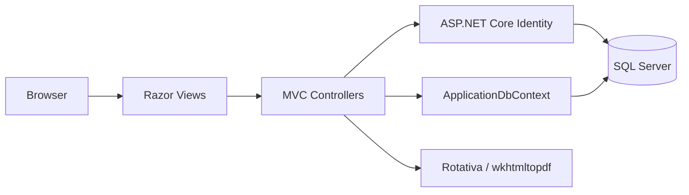

<div align="center">

# Codera Dev Road

**A server-rendered learning platform for discovering programming tracks, enrolling in courses, completing quizzes, and receiving certificates.**

**Digital Egypt Pioneers Initiative (DEPI) Graduation Project**<br>
Owned and maintained by **[Ahmed Abdelmonem](https://github.com/Ahmed15109)**

[](https://dotnet.microsoft.com/en-us/download/dotnet/8.0)
[](https://learn.microsoft.com/aspnet/core/mvc/overview)
[](https://learn.microsoft.com/ef/core/)
[](https://www.microsoft.com/sql-server)
[](https://learn.microsoft.com/aspnet/core/security/authentication/identity)
[**Live Demo**](https://codera.runasp.net/) · [**Repository**](https://github.com/Ahmed15109/Codera-Dev-Road)

</div>

## Project Overview

Codera Dev Road helps learners explore programming tracks, enroll in courses, follow structured lessons, complete quizzes, review results, and receive certificates. Administrators manage the learning catalog, assessments, notifications, certificates, and quiz results through role-protected workflows.

The application was developed collaboratively as a DEPI graduation project. Ahmed Abdelmonem maintains this repository as part of his software engineering portfolio, while the original team’s contributions remain preserved in Git history.

## Key Features

- **Learning catalog:** tracks, courses, detail pages, active enrollment, and enrollment-based content access.
- **Lessons and media:** ordered lessons with uploaded images and videos.
- **Quizzes and results:** quiz authoring, questions, answers, scoring, answer review, and stored result history.
- **Accounts and profiles:** ASP.NET Core Identity registration and sign-in, linked domain profiles, and profile-image uploads.
- **Notifications:** per-user and broadcast notifications with read-state management.
- **Certificates:** user- and course-linked certificates with PDF generation through Rotativa.
- **Administration:** role-protected management of tracks, courses, lessons, quizzes, questions, certificates, quiz results, and notifications.

## Technology Stack

| Area | Technologies |
| --- | --- |
| Runtime | .NET 8 (`net8.0`) |
| Web | ASP.NET Core MVC and Razor views |
| Authentication | ASP.NET Core Identity with Entity Framework Core 8.0.14 |
| Data | Entity Framework Core 8.0.15 and SQL Server |
| UI | Bootstrap 5.3.3, Bootstrap Icons 1.10.5, JavaScript, jQuery 3.6.0, jQuery Validation 1.19.5, and Unobtrusive Validation 4.0.0 |
| PDF generation | Rotativa.AspNetCore 1.4.0 with wkhtmltopdf |

## Architecture

Codera Dev Road is a single-project, server-rendered MVC application. Razor views provide the interface, controllers coordinate workflows and authorization, and controllers use `ApplicationDbContext` directly for domain and Identity data. SQL Server stores both ASP.NET Core Identity records and application entities; Rotativa renders certificate views as PDFs.



## Security

- Identity-based authentication with `Admin` and `User` role authorization.
- Ownership checks resolve profile, enrollment, notification, certificate, and result access from the authenticated Identity claim.
- Global antiforgery validation protects form posts.
- Identity cookies are HTTP-only, secure, and `SameSite=Strict`.
- Image and video uploads use allowed types, size limits, and generated filenames.
- Connection strings and bootstrap settings are supplied through User Secrets or environment variables. Administrator bootstrap is disabled unless explicitly enabled and creates or links the domain profile transactionally.

## Getting Started

### Prerequisites

- .NET 8 SDK
- SQL Server, SQL Server Express, or LocalDB
- Git and PowerShell
- Entity Framework Core CLI 8.x for migrations

### Setup

```powershell
git clone https://github.com/Ahmed15109/Codera-Dev-Road.git
cd Codera-Dev-Road
dotnet restore

dotnet user-secrets set "ConnectionStrings:DefaultConnection" "<LOCAL_SQL_CONNECTION_STRING>" --project .\progect_DEPI.csproj
dotnet user-secrets set "BootstrapAdmin:Enabled" "false" --project .\progect_DEPI.csproj

dotnet tool install --global dotnet-ef --version 8.0.15
dotnet ef database update --project .\progect_DEPI.csproj
dotnet run --project .\progect_DEPI.csproj
```

The project already declares a `UserSecretsId`. If the EF CLI cannot resolve User Secrets through the design-time context, apply the migration with `--connection "<LOCAL_SQL_CONNECTION_STRING>"` and keep the value local.

Use the HTTPS URL printed by ASP.NET Core for authenticated local workflows. The checked-in wkhtmltopdf executable is Windows-specific; cross-platform PDF hosting is listed in the roadmap.

<details>
<summary>Optional first-run administrator setup</summary>

For an empty database, configure these temporary User Secrets before running the application:

```powershell
dotnet user-secrets set "BootstrapAdmin:Email" "<ADMIN_EMAIL>" --project .\progect_DEPI.csproj
dotnet user-secrets set "BootstrapAdmin:FullName" "<ADMIN_FULL_NAME>" --project .\progect_DEPI.csproj
dotnet user-secrets set "BootstrapAdmin:Password" "<STRONG_ADMIN_PASSWORD>" --project .\progect_DEPI.csproj
dotnet user-secrets set "BootstrapAdmin:Enabled" "true" --project .\progect_DEPI.csproj
dotnet run --project .\progect_DEPI.csproj
```

The bootstrap creates or links one Identity/domain profile pair and assigns the `Admin` role without resetting an existing password. Disable it and remove the temporary values after setup:

```powershell
dotnet user-secrets set "BootstrapAdmin:Enabled" "false" --project .\progect_DEPI.csproj
dotnet user-secrets remove "BootstrapAdmin:Email" --project .\progect_DEPI.csproj
dotnet user-secrets remove "BootstrapAdmin:FullName" --project .\progect_DEPI.csproj
dotnet user-secrets remove "BootstrapAdmin:Password" --project .\progect_DEPI.csproj
```

</details>

## Project Structure

```text
Controllers/        MVC endpoints and workflows
Models/             Domain entities and ApplicationDbContext
ViewModels/         Form and quiz input models
Views/              Razor UI grouped by feature
Migrations/         EF Core SQL Server migrations
wwwroot/             CSS, JavaScript, media, and Rotativa assets
Program.cs           Services, middleware, roles, and startup
progect_DEPI.csproj  Target framework and package references
```

## Live Demo

[https://codera.runasp.net/](https://codera.runasp.net/)

The hosted demo is separate from this repository and may not reflect the latest local changes unless independently verified. Local security fixes should not be considered deployed until a separate deployment has occurred.

## Roadmap

- Add automated test coverage; no automated test project currently exists in the solution.
- Complete the `Payment` and `Review` user-facing workflows.
- Consolidate quiz scoring into one server-validated workflow so stored results and certificates are based on validated answers.
- Normalize learner role assignment during registration.
- Provide cross-platform deployment support for Rotativa/wkhtmltopdf.

## Project Ownership and Contributions

This repository is owned and maintained by **Ahmed Abdelmonem**. Codera Dev Road was developed collaboratively during the **Digital Egypt Pioneers Initiative (DEPI)**. The project reflects a collaborative team effort, with original authorship preserved through Git history.

### My Contributions — Ahmed Abdelmonem

As the primary backend developer on the project, I was responsible for designing and implementing most of the server-side application, including core business logic, data access, authentication, and administrative workflows.

My contributions include:

- Designed and implemented the majority of the ASP.NET Core MVC backend architecture and business logic.
- Developed and maintained most Controllers, including administrative and learner workflows.
- Designed and implemented Entity Framework Core data models, relationships, and database migrations.
- Integrated ASP.NET Core Identity with domain profiles using `IdentityId` and strengthened authentication and registration workflows.
- Implemented role-based authorization, ownership validation, and application security improvements.
- Developed course enrollment, lessons, quizzes, quiz results, certificates, notifications, and profile management features.
- Implemented image upload, storage, and rendering for courses and categories.
- Enhanced certificate generation and course-linked certificate management.
- Refactored application startup, configuration, and security settings.
- Consolidated database migrations and merged collaborative work while preserving contributor history.
- Wrote and maintained the project documentation and repository structure.

The project was developed collaboratively during the Digital Egypt Pioneers Initiative (DEPI). Original authorship and all team contributions remain preserved through Git history. Original attribution remains available through the [Git history](https://github.com/Ahmed15109/Codera-Dev-Road/commits) and the [GitHub contributors graph](https://github.com/Ahmed15109/Codera-Dev-Road/graphs/contributors).

## License

No repository-level license currently exists. This project should not be treated as open source or granted reuse rights without an explicit license. Third-party libraries retain their own licenses.

## Contact

**Ahmed Abdelmonem**

- GitHub: [Ahmed15109](https://github.com/Ahmed15109)
- LinkedIn: [ahmed-abdelmonem-2a43b824a](https://www.linkedin.com/in/ahmed-abdelmonem-2a43b824a)
